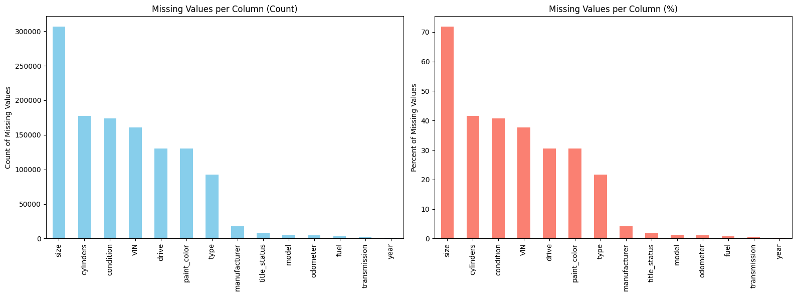

# priceOfACar
What drives the price of a car? The target audience for this model is - a used car dealership. 

# Problem Definition
For a used car dealership, our analysis focuses on identifying the key factors that drive vehicle resale prices. 
By examining attributes such as age, mileage, manufacturer, condition etc.,. We use data-driven modeling to 
reveal which features most impact pricing. These insights will help the dealership for inventory management, 
set competitive prices, and target the vehicles consumers value most.

# Data Understanding
First find how much data are we dealing with and what are the features that could potentially influence the "Target Variable" (Price)

## Key Predictors

**  id  **
**  region  **
**  price  **
**  year  **
**  manufacturer  **
**  model  **
**  condition  **
**  cylinders  **
**  fuel  **
**  odometer  **
**  title_status  **
**  transmission  **
**  VIN  **
**  drive  **
**  size  **
**  type  **
**  paint_color  **
**  state  **

## Missing and Bad Values

Using IQR did not give the expected cleanup. So I decided to chose hardoced ranges, using my domain knowledge as to what values are acceptable and resonable (As IQR is still having some unrealistic values like negative price and odometer readings).

First of lets plot the quality of the data.

### IQR reduction yields:

price: Keeping values between -24978.62 and 57364.38
year: Keeping values between 1994.50 and 2030.50
odometer: Keeping values between -106053.75 and 277300.25
Removed VIN duplicates: 282445
Original rows: 426880
Rows after IQR cleaning: 111861
Kept 26.2% of rows

### Hardcoded ranges yielded better

Total rows: 426880
Flagged by price   : 46439
Flagged by year    : 9618
Flagged by odometer: 6102
Missing required   : 5536
Removed VIN duplicates: 268299
Rows after cleaning: 99930
Kept 23.4% of rows

